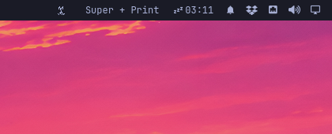

# Key Display

Shows the last key or key combination you pressed anywhere on the system, live in the Omarchy bar. Clicking the widget does nothing.



The widget captures global keyboard input by reading `/dev/input/event*` directly (via a small Python helper), so it works no matter which application has focus. The moment you release all keys, the display clears.

## Requirements

- An Omarchy (Quattro) shell.
- Your user must be in the `input` group, so the helper can read keyboard devices.
  Check with `groups`; if you are not a member, add yourself and re-login:

  ```sh
  sudo usermod -aG input "$USER"
  ```

## Install

```sh
omarchy plugin add https://github.com/pakucon/omarchy-keydisplay.git --enable
```

## Usage

Press any key or combination — for example `Shift + A` or
`Super + Ctrl + Shift + Space`. The combo appears in the bar and clears the
instant you release it.

## Configure

Move the widget to another bar section:

```sh
omarchy bar move jp.keydisplay --section center
```

## Remove

```sh
omarchy plugin remove jp.keydisplay
```

## How it works

A Python helper (`keymonitor.py`) opens every `/dev/input/event*` device
read-only (no grab, no second Quickshell process) and streams each resolved
key combo to the QML widget over stdout. Key names are resolved from the
Linux keycode table (`/usr/include/linux/input-event-codes.h` when present,
otherwise a built-in map), so there are no external dependencies.
